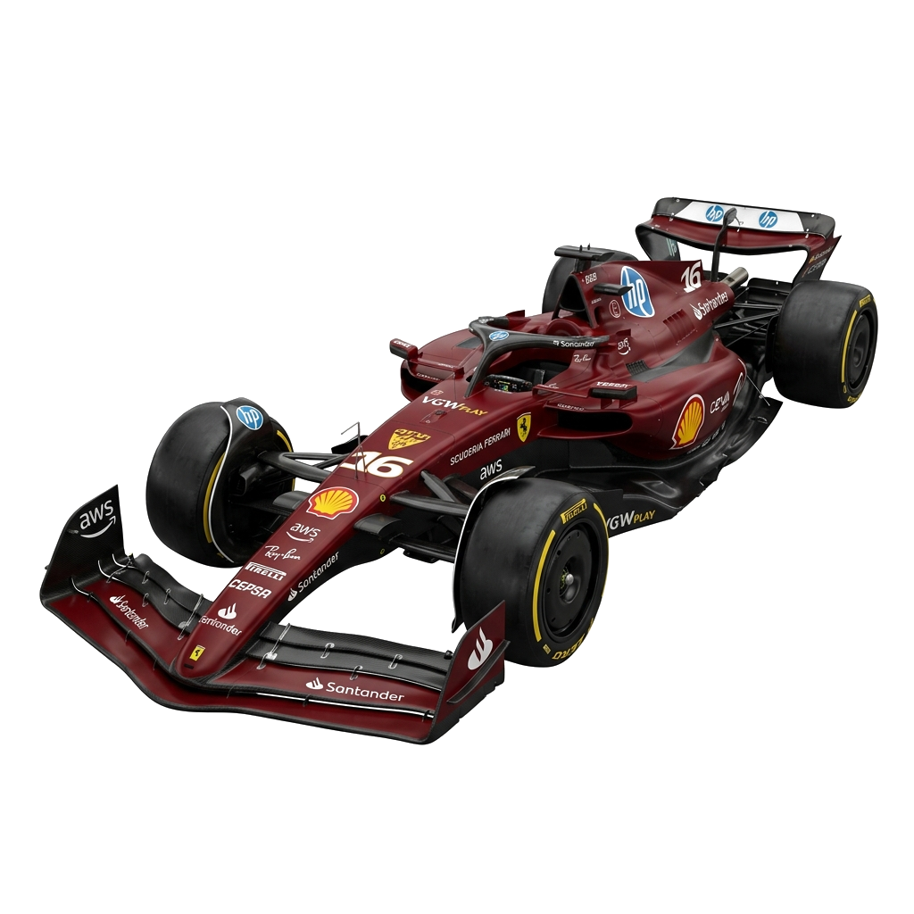

# PITWALL 🏎️
**Formula 1 Intelligence Platform**

PITWALL is a comprehensive, modern web application designed for Formula 1 fans and analysts. It aggregates real-time schedules, driver standings, constructor strategies, and features a neural prediction engine—all presented through a futuristic "Command Center" UI and stunning 3D graphics.



## ✨ Features
- **Immersive 3D Experience**: A high-fidelity, interactive 3D model of an F1 car built procedurally using Three.js and animated with GSAP ScrollTrigger.
- **Real-Time Data**: Integrates live F1 schedules, driver standings, and constructor points using the Jolpica-F1 and OpenF1 APIs.
- **Smart Caching Engine**: Custom PHP backend caches external API requests into a local SQLite database, drastically reducing load times and API rate limit issues.
- **Futuristic UI/UX**: Dark mode by default, featuring neon accents, telemetry ticker bars, and premium cyber-aesthetic components built with Tailwind CSS.

## 🛠️ Technology Stack
- **Frontend**: React (Vite), Tailwind CSS, React Router
- **3D & Animations**: Three.js, GSAP (ScrollTrigger)
- **Backend**: PHP 8.2
- **Database**: SQLite (for API caching & user predictions)
- **External Data**: [Jolpica-F1 API](https://api.jolpi.ca) & [OpenF1 API](https://openf1.org)

---

## 🚀 Getting Started

Follow these steps to set up and run the project on your local machine.

### Prerequisites
1. **PHP 8.2+**: Ensure PHP is installed and added to your system's PATH. (If using XAMPP, PHP is included).
2. **Node.js & npm**: Required to build and run the React frontend.
3. **SQLite**: The PDO SQLite extension must be enabled in your `php.ini`.

### 1. Installation
Clone or extract the repository, then navigate to the project directory:
```bash
cd path/to/project
```

Install the frontend dependencies:
```bash
npm install
```

### 2. Starting the Servers
This project uses a decoupled architecture in development. You need to run both the PHP backend API server and the Vite frontend dev server simultaneously. Open **two separate terminals** in the project root.

**Terminal 1: Start the PHP Backend**
This will start the PHP built-in server with the router script (`public/index.php`) so API routes work correctly.
```bash
php -S localhost:8000 -t public public/index.php
```

**Terminal 2: Start the React Frontend**
```bash
npm run dev
```

### 3. Open the App
Once both servers are running, open your browser and navigate to:
**http://localhost:5173**

---

## 📂 Project Structure
```text
/
├── php/                  # Backend PHP classes (Database, F1ApiClient)
├── public/
│   ├── api/              # PHP API endpoints (/api/races, /api/drivers, etc.)
│   ├── index.php         # Front controller & router for PHP backend
│   └── ...               # Static assets (images, fonts)
├── src/
│   ├── components/       # Reusable React components & Three.js 3D scenes
│   ├── hooks/            # Custom React hooks (useF1Api)
│   ├── pages/            # Main application pages (Home, Races, Drivers, etc.)
│   ├── App.jsx           # React Router setup
│   └── index.css         # Tailwind directives and custom CSS
├── docs/                 # Project documentation and synopsis
└── package.json          # Frontend dependencies
```

## 📝 Notes
- **Database**: The SQLite database (`php/f1_cache.db`) is generated automatically the first time an API request is made. Ensure the `php/` directory has write permissions.
- **Port Conflicts**: If port `8000` or `5173` is already in use on your machine, you can change them in the start commands and update the proxy settings in `vite.config.js`.

---
*Disclaimer: This project is for educational purposes and is not affiliated with the Formula 1 Group.*
